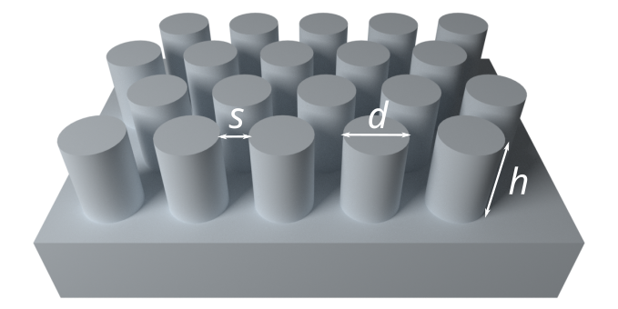
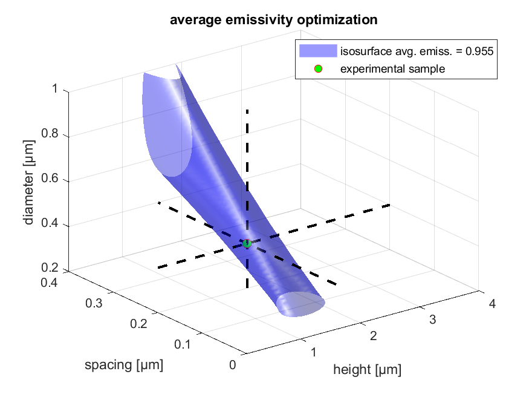

# Emissivity optimization for a micropatterned SiO2 layer

Dataset related to the publication HMT_125004:
> Zhenmin Ding, Xin Li, Hulin Zhang, Dukang Yan, Jérémy Werlé, Ying Song, Lorenzo Pattelli, Jiupeng Zhao, Hongbo Xu, Yao Li.
> Robust radiative cooling via surface phonon coupling-enhanced emissivity from SiO2 micropillar arrays.
> *International Journal of Heat and Mass Transfer*, 125004 (2023). doi: [10.1016/j.ijheatmasstransfer.2023.125004](https://doi.org/10.1016/j.ijheatmasstransfer.2023.125004)

The repository contains MATLAB/Octave scripts to perform rigorous coupled-wave analysis (RCWA) simulations for a SiO2 layer decorated with micropillars.

The main script runs a series of rigorous electromagnetic simulations over the atmospheric transparency window wavelength range (8-13 µm) for all combination of three main structural parameters (pillar diameter, spacing and height), within a user-defined range.

Running the code requires the RETICOLO v9 RCWA code:
> Jean-Paul Hugonin, & Philippe Lalanne. (2021). Light-in-complex-nanostructures/RETICOLO: V9. Zenodo. [https://doi.org/10.5281/zenodo.4419063](https://doi.org/10.5281/zenodo.4419063)

The repository contains:
* `Exhaustive_parameter_search.m`: main script setting up and running all simulations
* `Input_param.csv`: the explored parameter space
* `SiO2_J. Kischkat, S. Peters.txt`: complex refractive index of SiO2 taken from the refractiveindex.info [database](https://refractiveindex.info/?shelf=main&book=SiO2&page=Kischkat)
* `Abs.csv`, `Rup.csv`, `Tup.csv` files containing the plain text output of the exhausive search
* `Exhaustive_parameter_search_plot_results.m`: script interpolating and plotting the output. Running this script should generate the following figure

